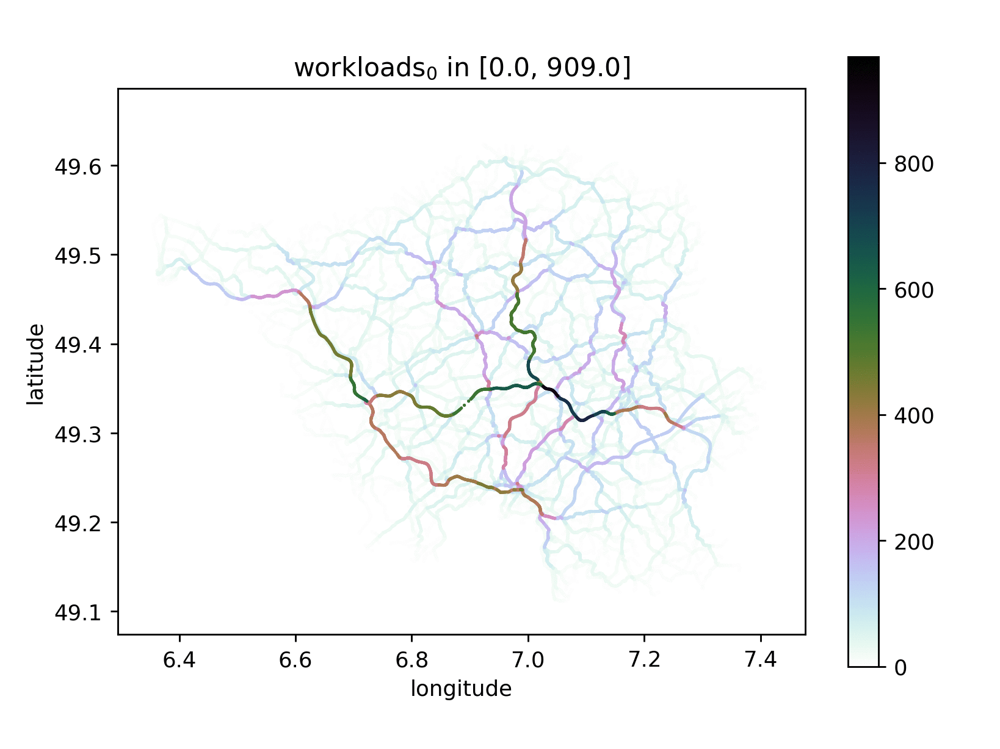

# osmgraphing

[![Build Status nightly][github/self/actions/badge]][github/self/actions]

[![Tag][github/self/tags/badge]][github/self/tags]
[![Crates.io][crates.io/self/badge]][crates.io/self]
[![Docs][docs.rs/self/badge]][docs.rs/self]

[![Changelog][github/self/blob/changelog/badge]][github/self/blob/changelog]
[![Last commit][github/self/last-commit/badge]][github/self/last-commit]

[![License][github/self/license/badge]][github/self/license]

[](resources/saarland_2020-07-30/balancing/workloads.gif)
> This GIF shows, how the balancing improves the distribution of `10,000` paths over the network of the German state `Saarland`.
> New paths from `s` to `t` are guaranteed being not worse than `25 %` than the optimal path from `s` to `t`, with respect to travel-duration (so `55 min` becomes under `1 h 10 min` in the worst-case).

Welcome to the `osmgraphing`-repo! `:)`
Goal of this repo is parsing [openstreetmap][osm]-data to calculate traffic-routes and different related use-cases on it.
This repo will be involved in dealing with the analysis of selfish routing and learning metrics for balancing load in street-networks.
However, if a self-written parser-module does exist, every map-format supported by this module (e.g. own `csv`-like formats) can be used, which doesn't need to be a street-network.

All calculations will be optimized for a single desktop instead of a more expensive cluster.
The current machine (__August 2020__) uses an `AMD Ryzen 7 3700X 8-Core Processor` and has __`32 GB` of `RAM`__.


## Reason for `version < 1.0.0` <a name="version"></a>

I'm currently building this library for my master-thesis (submission __August 2020__), leading to interface-changes with breaking changes (at least) every few weeks, why version `1.0.0` is not supported yet.
However, the underlying parser and graph-structure are working very stable, efficiently, tested with different maps (see `resources/`), and will be used to simulate different routing-scenarios, so version `1.0.0` should be reached soon. `:)`


## Copyright and License <a name="copyright_and_license"></a>

Please refer to `LICENSE.md` for details.
Copyright-owner is `Parga Cacheiro, Dominic`.
In short, this repository is licensed under the `Apache-2.0`-license as long as you are not using the `cargo`-feature `gpl-3.0`.
Using this `cargo`-feature adds some code and binaries, which depend on code licensed under the `GPL-3.0`.


## Table of contents <a name="toc"></a>

1. [Reason for version < 1.0.0][self/version]
1. [Copyright and License][self/copyright_and_license]
1. [Table of contents][self/toc]
1. [Setup and usage][self/setup-and-usage]
    1. [Long story short][self/long-story-short]
    1. [Downloading and generating maps][self/downloading-and-generating]
    1. [Editing the config][self/editing-the-config]
    1. [Inlined metrics][self/inlined-metrics]
    1. [Requirements for large maps (e.g. countries)][self/large-maps]
    1. [Contraction-Hierarchies][self/contraction-hierarchies]
1. [Balancing][self/balancing]
1. [Credits][self/credits]


## Setup and usage <a name="setup-and-usage"></a>

Please find instructions and info below.


### Long story short <a name="long-story-short"></a>

Rust has a build-tool called `cargo`, which can be used to run everything except scripts in `scripts/`.
The concept of all this repo's binaries lays on the usage of config-files.
You can find all available options in `resources/blueprint.yaml` and examples in `resources/<map-name>`.

```zsh
# Build the binary for parsing maps and do routing
# and parse isle-of-man.
cargo run --release --bin osmgraphing -- --config resources/isle_of_man_2020-03-14/osm.pbf.yaml --routing
# Further execution-info
cargo run --release --bin osmgraphing -- --help
```

You can download `pbf`-files from [geofabrik][geofabrik].
When editing the config, take [`resources/blueprint.yaml`][github/self/blob/blueprint.yaml] as guide.

For using the balancer, you have to enable features licensed under the `GPL-3.0`.
Besides that, please find installation-info about the submodule in the [`multi-ch-constructor`-repo][github/lesstat/multi-ch-constructor], because it is written in `c++`.
For usage, this `osmgraphing`-repo has a module wrapping the submodule, using configs for its execution-parameters.

```zsh
# Update git-submodules used in the balancer
git submodule update --init --recursive
# Build also features licensed under the `GPL-3.0`.
# Build with GRAPH_DIM=6.
GRAPH_DIM=6 cargo run --release --features='gpl-3.0' --bin osmgraphing -- --config resources/isle_of_man_2020-03-14/balancing/config.yaml --balancing
```

As mentioned above, you may find a detailled config-blueprint in `resources/` and a balancing-example in `resources/isle_of_man/`.
As defined in the `config.yaml`, the results can be found in `custom/results/isle_of_man` and may be visualized with the python-module in `scripts/`.
The python-tool has a help-msg, but the balancer also prints the respective command after finishing.

Get further help with `cargo run --bin osmgraphing -- --help`.


### Overview over all features

The following table shows all features of this repository.
The `cargo`-features are needed to build the respective feature.
Some `cargo`-features are optional for the feature, meaning that the `cargo`-feature adds extra-functionality.
You can build with `cargo`-features using `cargo build --features='F0,F1,...'` (`cargo run` builds implicitely).

| `cargo`-feature | Notes |
|:---------------:|:------|
| `'gpl-3.0'` | This feature is needed for every part of the code, that is licensed under the `GPL-3.0`. Even if you are using this `cargo`-feature, it doesn't force you to license data under the `GPL-3.0`, that has been created with the `gpl-3.0`-code. |
| `'custom'` | This repository ships with small maps, like handmade maps or `Isle-of-Man`, but larger maps like the German state `Saarland`, parts of German states like `Stuttgart-Regierungsbezirk` or countires like `Germany` consume multiple `100 MB` and more memory. Although, some tests are using these maps and configs may be useful, which is the reason for this `cargo`-feature. To get this feature working, simply download the maps, move them into the respective map-directory in `resources/`, and name them according to other map-directories. |


### Downloading and generating maps <a name="downloading-and-generating"></a>

Downloaded osm-data is provided in xml (`osm`) or binary (`pbf`), where nodes are related to location in latitude and longitude.
Problems will be the size-limit when downloading from [openstreetmap][osm], but there are other osm data providers like [geofabrik][geofabrik] for instance.
For now, without a parser-module for `osm`-data, only binary `osm.pbf`-data is supported.

For testing, some simple text-based format `fmi` is used.
Since they are created manually for certain tasks, parsing them - generally speaking - is unstable.
However, this repository has a generator, which can create such `fmi`-files from `pbf`- or other `fmi`-files (e.g. for different metric-order) based on a config.

A tool for creating `fmi`-map-files, containing graphs contracted via contraction-hierarchies, is [multi-ch-constructor][github/lesstat/multi-ch-constructor], which is used in the balancer and hence a submodule of this repo.
Further, this repo has a wrapping binary `multi-ch-constructor` for the submodule, using a config as well.


### Editing the config <a name="editing-the-config"></a>

Every possible option of a config is described in [`resources/blueprint.yaml`][github/self/blob/blueprint.yaml].
The binaries (`osmgraphing`, `multi-ch-constructor`) (binaries are in `target/release` after release-building) use the config for different use-cases.

### Inlined metrics <a name="inlined-metrics"></a>

Metrics are inlined using [`SmallVec`][github/servo/rust-smallvec].
This improves performance and can save several `GB` of `RAM`.
If your config uses less metrics than you have compiled to, you will receive a warning.
Further, if the compiled number of inlined metrics is less than the number of your config's metrics, the graph can't be used efficiently and throws an error.
In this case, you must change the number of inlined metrics according to your needs, and rebuild.
The command `cargo build` simply becomes `GRAPH_DIM=6 cargo build`.
The default is quite small (`~4`), but may change over time.


### Requirements for large maps (e.g. countries) <a name="large-maps"></a>

In general, the requirements depend on the size of the parsed map (also same map of different dates) and your machine.
Following numbers base on an __`8-core-CPU`__ and the `pbf`-maps from `March 14th, 2020` running on `archlinux` with __`16 GB` `RAM`__.
Basing on the numbers below, without doing further detailled benchmarks, the memory-usage scales linearly with the graph-size with a growth-factor of `0.5`.
Hence you could expect around `2x` `RAM`-usage for `4x` graph-size (meaning `4x` node- and `4x` edge-count).

- Parsing `Germany.pbf` (`4` metrics,  `~51 million` nodes, `~106 million` edges) needs around __`14 GB` of `RAM`__ at peak.
  After parsing, the memory-needs are much lower due to the optimized graph-structure.
- Preprocessing `Germany.pbf` (including parsing) needs less than __`4 minutes`__.
- A __routing query__ on `Germany.pbf` of distance around `600 km` takes around __`22 seconds`__ with `bidirectional Dijkstra`, highly depending on the specific src-dst-pair (and its search-space).
  This could be improved by removing intermediate nodes (like `b` in `a->b->c`), but they are kept for now.
  Maybe, they are needed for precise/realistic traffic-simulation (e.g. visualization).
  An `Astar` is not used anymore, because its only purpose is reducing the search-space, which can be reduced much more using [`Contraction Hierarchies`][self/contraction-hierarchies].
  Further, `Astar` has issues when it comes to multiple or custom metrics, because of the metrics' heuristics.

Small maps like `Isle_of_Man.pbf` (`~50_000` nodes, `~107_000` edges) run on every machine and are parsed in less than a second.

The German state `Baden-Württemberg.pbf` (`~9 million` nodes, `~18 million` edges) needs less than __`5 GB` `RAM`__ at peak and around __`30 seconds`__ to parse.


### Contraction-Hierarchies <a name="contraction-hierarchies"></a>

For speedup, this repository uses and supports graphs contracted via contraction-hierarchies by a submodule [`lesstat/multi-ch-constructor`][github/lesstat/multi-ch-constructor].
This submodule generates contracted graphs from `fmi`-files of a certain format (see below).
The submodule is called through a thin wrapper in this `osmgraphing`-repo building and calling `multi-ch-constructor`.
This wrapper uses a config for building and execution, which makes reproducability easier.
Keep this in mind when reading the following explanations.
See `resources/blueprint.yaml` for detailled infos about configs.

First of all, the tool `multi-ch` needs an `fmi`-map-file of specific format as input.
To generate such a `fmi`-map-file in the correct format, the binary `osmgraphing` can be used with a config following the [defined requirements][github/lesstat/cyclops/blob/README].

The `ignored`s and placeholders (e.g. `ch-level`) in the config are important, because the `multi-ch-constructor` needs them.
Besides that, the `multi-ch-constructor` uses node-indices as ids, leading to errors when the mapping `node -> indices [0; n]` is not surjective.
Therefore, export the graph's edges using `src-idx` and `dst-idx` instead of `srd-id` and `dst-id`.
A flag of the `multi-ch-constructor` (can be set in the config) allows the export of the respective node-ids (instead of their indices) when printing edges.

The `multi-ch`-tool needs 3 counts at the file-beginning: metric-count (dimension), node-count, edge-count.
The `osmgraphing`-binary does add these counts in this order.

Before the `multi-ch`-tool can be used, it has to be built.
For the sake of optimization, you have to set the metric-count as dimension, similar to the `GRAPH_DIM` in `osmgraphing`.
Set this dimension in the config-file according to the dimension in the previously generated `fmi`-file (the `c++`-submodule allows this via `cmake`).
See its README for more info.

> Note that the multi-ch-constructor is not deterministic (March 12th, 2020).
> Using it does only speedup your queries, but due to a different resulting order in the priority, or rounding-errors, it could lead to different paths of same weight.


## Balancing <a name="balancing"></a>

See `cargo run --features='gpl-3.0' --release --bin osmgraphing -- --help`.


## Credits <a name="credits"></a>

The project started in the mid of 2019 as a student project.
This section honors the workers and helpers of this project, sorted by their last names.

__[Florian Barth][github/lesstat]__  
is the supervisor of the project since beginning and is always helping immediately with his experience and advice.

__[Dominic Parga Cacheiro][github/dominicparga]__  
has been part of the project's first weeks when project-planning and learning Rust was on the scope.
He continues the work and is improving and extending the simulation.
One large of his extensions is distributing routes over a given network.

__[Jena Satkunarajan][github/jenasat]__  
has been part of the project's first weeks when project-planning and learning Rust was on the scope.
He has implemented the first (and running) approach of the `A*`-algorithm.


[crates.io/self]: https://crates.io/crates/osmgraphing
[crates.io/self/badge]: https://img.shields.io/crates/v/osmgraphing?style=for-the-badge
[docs.rs/self]: https://docs.rs/osmgraphing/0/
[docs.rs/self/badge]: https://img.shields.io/crates/v/osmgraphing?color=informational&label=docs&style=for-the-badge
[geofabrik]: https://geofabrik.de
[github/dominicparga]: https://github.com/dominicparga
[github/jenasat]: https://github.com/JenaSat
[github/lesstat]: https://github.com/lesstat
[github/lesstat/cyclops/blob/README]: https://github.com/Lesstat/cyclops/blob/master/README.md#graph-data
[github/lesstat/multi-ch-constructor]: https://github.com/Lesstat/multi-ch-constructor
[github/lesstat/multi-ch-constructor/change-dim]: https://github.com/Lesstat/multi-ch-constructor/blob/bec548c1a1ebeae7ac19d3250d5473199336d6fe/src/multi_lib/graph.hpp#L49
[github/self/actions]: https://github.com/dominicparga/osmgraphing/actions
[github/self/actions/badge]: https://img.shields.io/github/workflow/status/dominicparga/osmgraphing/Rust?label=nightly-build&style=for-the-badge
[github/self/blob/blueprint.yaml]: https://github.com/dominicparga/osmgraphing/blob/nightly/resources/blueprint.yaml
[github/self/blob/changelog]: https://github.com/dominicparga/osmgraphing/blob/nightly/CHANGELOG.md
[github/self/blob/changelog/badge]: https://img.shields.io/badge/CHANGELOG-nightly-blueviolet?style=for-the-badge
[github/self/blob/defaults.rs]: https://github.com/dominicparga/osmgraphing/blob/nightly/src/defaults.rs
[github/self/last-commit]: https://github.com/dominicparga/osmgraphing/commits
[github/self/last-commit/badge]: https://img.shields.io/github/last-commit/dominicparga/osmgraphing?style=for-the-badge
[github/self/license]: https://github.com/dominicparga/osmgraphing/blob/nightly/LICENSE.md
[github/self/license/badge]: https://img.shields.io/badge/LICENSE-Apache--2.0%20OR%20GPL--3.0-green?style=for-the-badge
[github/self/tags]: https://github.com/dominicparga/osmgraphing/tags
[github/self/tags/badge]: https://img.shields.io/github/v/tag/dominicparga/osmgraphing?sort=semver&style=for-the-badge
[github/self/tree/examples]: https://github.com/dominicparga/osmgraphing/tree/nightly/examples
[github/self/wiki/usage]: https://github.com/dominicparga/osmgraphing/wiki/Usage
[github/servo/rust-smallvec]: https://github.com/servo/rust-smallvec
[osm]: https://openstreetmap.org
[self/balancing]: #balancing
[self/contraction-hierarchies]: #contraction-hierarchies
[self/copyright_and_license]: #copyright_and_license
[self/credits]: #credits
[self/downloading-and-generating]: #downloading-and-generating
[self/editing-the-config]: #editing-the-config
[self/inlined-metrics]: #inlined-metrics
[self/large-maps]: #large-maps
[self/long-story-short]: #long-story-short
[self/setup-and-usage]: #setup-and-usage
[self/toc]: #toc
[self/version]: #version
